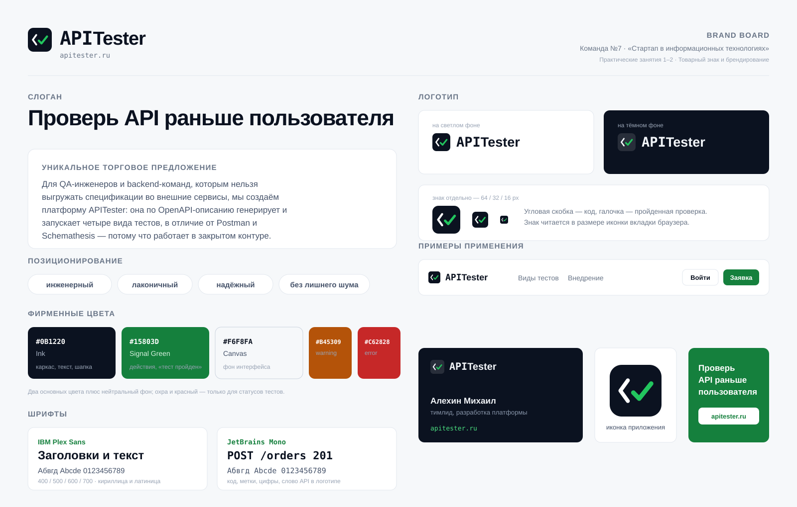

# Стартап в информационных технологиях
## Практические занятия 1-2
## Тема практических занятий: Товарный знак и брендирование

### Команда №7
|Участник|Роль|
|---|---|
|Алехин Михаил Алексеевич|Тимлид/Разработчик|
|Павличенко Александр Иванович|Разработчик|
|Токарева Александра Евгеньевна|Аналитик/Маркетолог|
|Чуркина Анастасия Дмитриевна|Разработчик/Аналитик|

---

## 1. Название

**APITester**

К этому занятию у проекта уже был работающий прототип и купленный домен **apitester.ru**, поэтому название мы не придумывали с нуля, а закрепляли то, что фактически используется. Рабочее сокращение прошлого семестра (IAT — API Intelligent Testing) мы решили не сохранять: аббревиатура ничего не говорит человеку, который видит её впервые, и её приходилось каждый раз расшифровывать на встречах с потенциальными заказчиками.

Аргументы за APITester:

- название прямо называет предмет — тестирование API, расшифровка не нужна;
- совпадает с доменом, поэтому адрес сайта запоминается вместе с названием;
- читается одинаково на русском и на английском («эй-пи-ай тестер»), что важно, потому что аудитория продукта — разработчики и QA, привыкшие к английской терминологии;
- пишется одним словом с заглавной T (APITester), что позволяет в логотипе разделить «API» и «Tester» разными шрифтами.

Минус названия мы тоже зафиксировали: оно описательное, а такие обозначения сложно зарегистрировать как словесный товарный знак (см. раздел 9).

## 2. Слоган

> **Проверь API раньше пользователя**

Слоган строится на главной боли заказчика: ошибку в API почти всегда находит не команда, а клиент — уже в продакшене. Формулировка короткая (четыре слова), содержит глагол-призыв и не требует пояснений.

Рассматривали ещё три варианта:

|Вариант|Почему отклонён|
|---|---|
|«API под контролем»|Слишком общее, подходит любому мониторингу|
|«Четыре вида тестов — одна платформа»|Описывает функциональность, а не выгоду, и длинновато|
|«Тестируем API за вас»|Читается как аутсорс-услуга, а мы продаём инструмент|

## 3. Уникальное торговое предложение

Шаблон: *Для [целевой аудитории] мы создаём [продукт], который помогает [решить проблему], в отличие от [конкурентов], потому что [ключевое преимущество].*

> Для **QA-инженеров и backend-команд в компаниях, где спецификации API нельзя выгружать во внешние сервисы**, мы создаём **платформу APITester**, которая **по OpenAPI-описанию и текстовой постановке задачи автоматически генерирует и запускает модульные, интеграционные, сквозные и нагрузочные тесты**, в отличие от **Postman, Schemathesis, EvoMaster и Kusho**, потому что **закрывает все четыре вида тестирования в одном интерфейсе и разворачивается в закрытом контуре заказчика**.

Что здесь конкретно и проверяемо:

- **четыре вида тестирования** — сравнение с конкурентами по этому признаку мы делали ещё в первом семестре, таблица подтверждает, что ни одно из зарубежных решений не закрывает все четыре;
- **закрытый контур** — Postman и Kusho работают только как облако, для банков и госкомпаний это блокирующее ограничение;
- **генерация по спецификации** — сценарии не пишутся руками, на входе OpenAPI-файл и короткое описание задачи.

## 4. Позиционирование

Тон бренда: **инженерный, лаконичный, надёжный, без лишнего шума**.

Мы намеренно ушли от «дружелюбного» стиля с иллюстрациями и восклицательными знаками. Покупатель продукта — технический руководитель или QA-лид, который оценивает инструмент по функциональности и по тому, насколько быстро в нём разберётся команда. Поэтому:

- в текстах нет маркетинговых превосходных степеней, вместо «лучший инструмент» пишем, что именно делает продукт;
- на сайте показан реальный интерфейс, а не абстрактные иллюстрации;
- вся терминология оставлена в привычном для разработчиков виде (эндпоинт, сценарий, прогон, RPS).

## 5. Визуальная айдентика

### 5.1. Фирменные цвета

Взяли два основных цвета плюс нейтральный фон — как и рекомендовано, не больше трёх.

|Цвет|HEX|Роль|
|---|---|---|
|Ink (чернильный)|`#0B1220`|Каркас бренда: логотип, заголовки, шапка сайта, тёмные блоки|
|Signal Green|`#15803D` (светлая тема) / `#22C55E` (тёмная)|Действие и успех: кнопки, активные пункты меню, статус «тест пройден»|
|Canvas|`#F6F8FA`|Фон интерфейса и сайта|

Дополнительно, только для статусов тестов (в фирменную тройку не входят):

|Цвет|HEX|Роль|
|---|---|---|
|Warning|`#B45309`|Требует внимания, код ответа 4xx|
|Error|`#C62828`|Упавшая проверка|
|Info|`#1D4ED8`|Служебные подсказки, метод POST|

Логика выбора: зелёный — это цвет пройденного теста, он уже «встроен» в предметную область (зелёная галочка в CI, зелёный прогон в отчёте). Делая его цветом действия, мы получаем связку «нажми кнопку — получи зелёный результат». Чернильный тёмно-синий работает как нейтральный корпоративный фон и не спорит с зелёным.

Контраст проверяли: тёмный текст на светлом фоне и белый текст на зелёной кнопке дают отношение выше 4.5:1, то есть проходят требования доступности WCAG AA. Для тёмной темы зелёный пришлось осветлить до `#22C55E`, а текст на кнопке сделать почти чёрным — иначе кнопка «слепила» бы на тёмном фоне.

### 5.2. Шрифты

|Шрифт|Где используется|Почему|
|---|---|---|
|**IBM Plex Sans**|Заголовки, основной текст, интерфейс|Открытая лицензия, есть кириллица и латиница, нейтральный «инженерный» характер без офисной сухости Arial|
|**JetBrains Mono**|Код, HTTP-методы, цифры, метки разделов, слово «API» в логотипе|Разработан для чтения кода, есть кириллица; моноширинный шрифт сразу сообщает, что перед вами технический продукт|

Обе гарнитуры бесплатные и подключаются с Google Fonts, лицензионных ограничений для коммерческого использования нет.

### 5.3. Логотип

Знак — скруглённый квадрат чернильного цвета, внутри угловая скобка `‹` белым и зелёная галочка. Смысл прямой: скобка — это код, галочка — пройденная проверка. Вместе получается «код проверен».

Логотип — знак плюс надпись, где «API» набрано JetBrains Mono (жирное начертание), а «Tester» — IBM Plex Sans. Смена шрифта внутри слова визуально разделяет техническую часть названия и обычное слово, при этом надпись остаётся единым словом.

Варианты:

|Файл|Назначение|
|---|---|
|[assets/logo.svg](assets/logo.svg)|Основной, для светлого фона|
|[assets/logo-inverse.svg](assets/logo-inverse.svg)|Для тёмного фона, подложка знака полупрозрачная|
|[assets/logo-mark.svg](assets/logo-mark.svg)|Только знак: аватар, иконка приложения, favicon|

Знак проверяли на читаемость в 64, 32 и 16 пикселей — в размере иконки вкладки он остаётся узнаваемым, поэтому отдельная упрощённая версия не понадобилась.

Логотип отрисован в векторе, финальные файлы сохранены в SVG и лежат в репозитории; тот же знак подключён как favicon сайта.

## 6. Brand board

Исходник листа — [assets/brand-board.svg](assets/brand-board.svg).

## 7. Примеры применения

На brand board показаны четыре носителя:

1. **Шапка сайта** — логотип слева, зелёная кнопка целевого действия справа.
2. **Визитка** — чернильный фон, инверсный логотип, адрес сайта зелёным.
3. **Иконка приложения** — только знак на скруглённом квадрате.
4. **Баннер** — сплошной зелёный фон, слоган и адрес сайта.

Отдельно бренд уже перенесён в сам продукт: сайт и рабочее пространство на apitester.ru переоформлены под новую айдентику. Все цвета, шрифты, отступы и скругления вынесены в набор CSS-переменных, поэтому светлая и тёмная темы собираются из одного описания, а не дублируются по страницам.

## 8. Как позиционируют себя конкуренты

|Продукт|Визуальный язык|Что говорит о себе|Наш вывод|
|---|---|---|---|
|Postman|Оранжевый акцент, круглый знак-«ракета», много иллюстраций|Платформа для всей работы с API|Оранжевый занят и слишком «потребительский» для нашей аудитории|
|Schemathesis|Минимум оформления, документация вместо лендинга|Инструмент для property-based тестирования|Подтверждает, что технической аудитории достаточно сдержанного оформления|
|Kusho|Тёмная тема, фиолетово-синий градиент, акцент на AI|AI-агент, который пишет тесты|Фиолетовый и «AI» как главный аргумент уже сильно заняты, уходим в сторону надёжности|
|DIASOFT (тестирование)|Корпоративный синий, строгие блоки|Российское enterprise-решение|Ближайший ориентир по тону, но у них нет отдельного бренда именно у продукта тестирования|

Свободная ниша по цвету — зелёный: у прямых конкурентов он либо не используется, либо встречается только как индикатор статуса. Это дополнительный аргумент за выбранную палитру.

## 9. Товарный знак

Что мы можем регистрировать в Роспатенте:

|Тип обозначения|Что именно|Оценка перспектив|
|---|---|---|
|Словесное|«APITester»|Низкая. Обозначение описательное: прямо указывает на вид товара (тестирование API), а такие обозначения по ст. 1483 ГК РФ регистрации не подлежат или регистрируются как неохраняемый элемент|
|Графическое|Знак — скобка с галочкой|Высокая. Знак оригинальный, не повторяет чужие обозначения|
|Комбинированное|Знак + надпись APITester|Средняя. Регистрируется как единое обозначение, при этом слово APITester получает статус неохраняемого элемента|

Практический вывод для нас: если доходить до регистрации, подавать надо комбинированное обозначение — оно защищает конкретную связку знака и надписи. На стадии MVP регистрация не обязательна, но важно уже сейчас не использовать чужие названия и логотипы. Домен apitester.ru занят нами; перед подачей заявки нужно проверить обозначение по открытому реестру Роспатента в классах МКТУ 9 (программы для ЭВМ) и 42 (разработка и тестирование ПО) — эту проверку выносим в задачи на следующее занятие.

## 10. Итоги занятия

Что получилось к концу работы:

- закреплено название **APITester** и приведён к нему домен и весь интерфейс;
- сформулированы слоган и УТП по шаблону, оба построены на конкретных отличиях от конкурентов, а не на общих словах;
- выбраны фирменные цвета, шрифтовая пара и разработан логотип в трёх вариантах;
- собран brand board на одном листе;
- айдентика перенесена в продукт: лендинг, страница входа, рабочее пространство и админ-панель оформлены в едином стиле, добавлена тёмная тема;
- разобрано, что и в каком виде имеет смысл регистрировать как товарный знак.

Что осталось на следующие занятия: проверить обозначение по реестру Роспатента, показать название и знак фокус-группе из QA-инженеров и подготовить презентационные материалы для встреч с потенциальными заказчиками.
