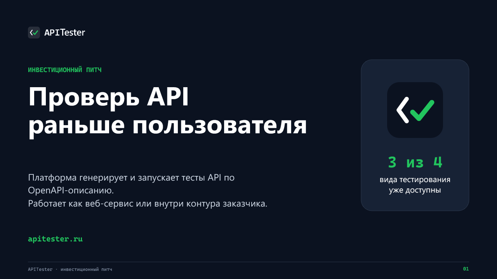
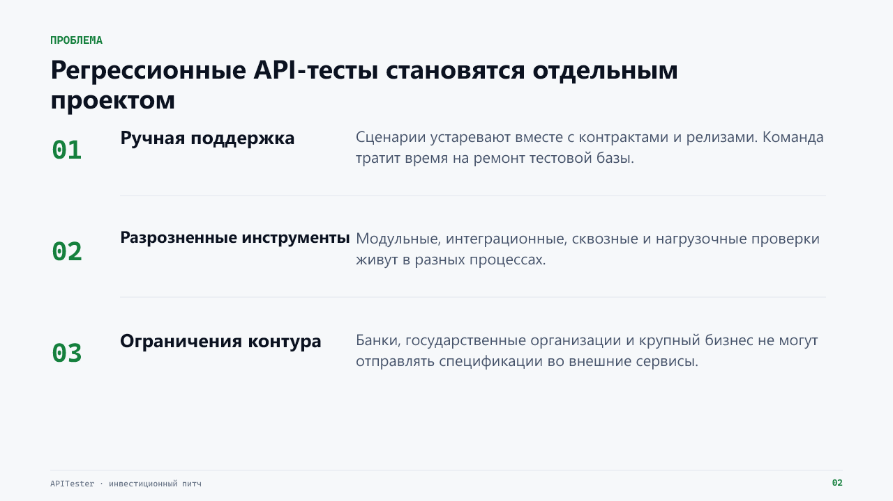
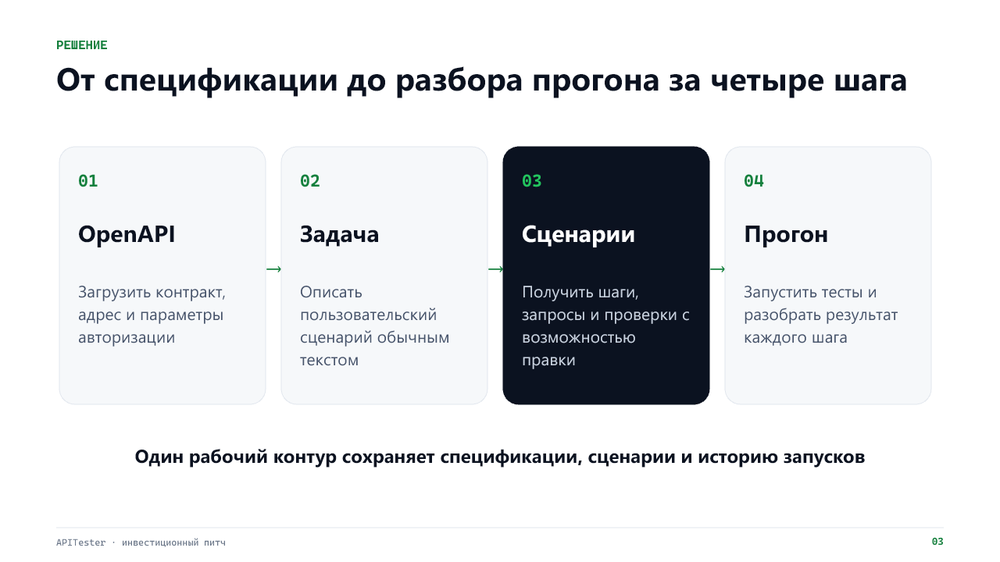
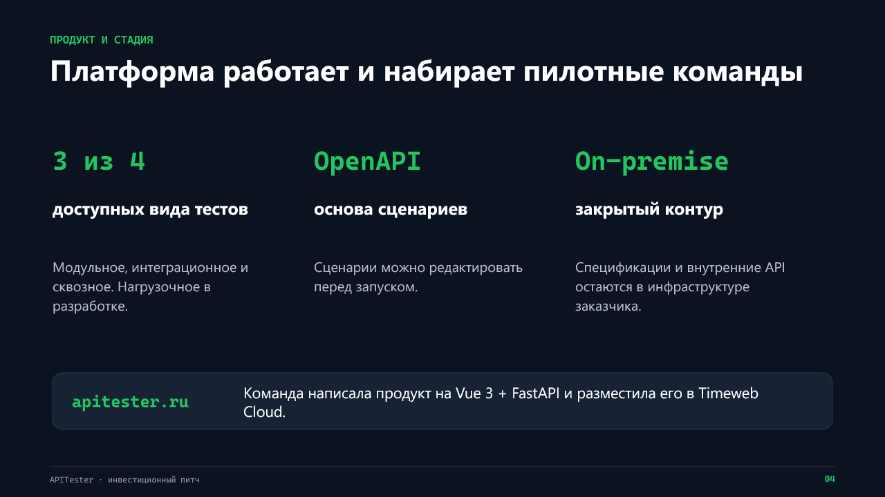
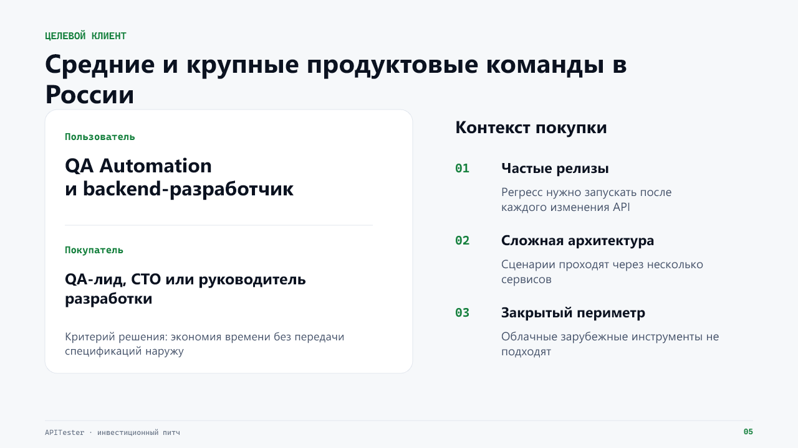
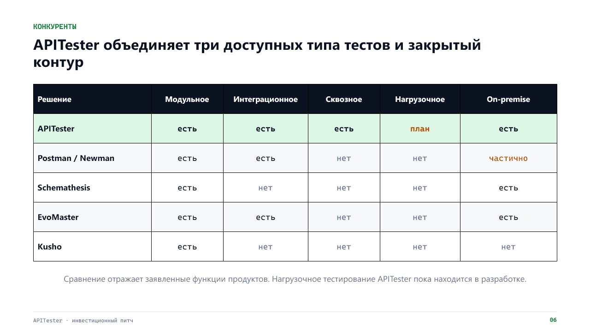
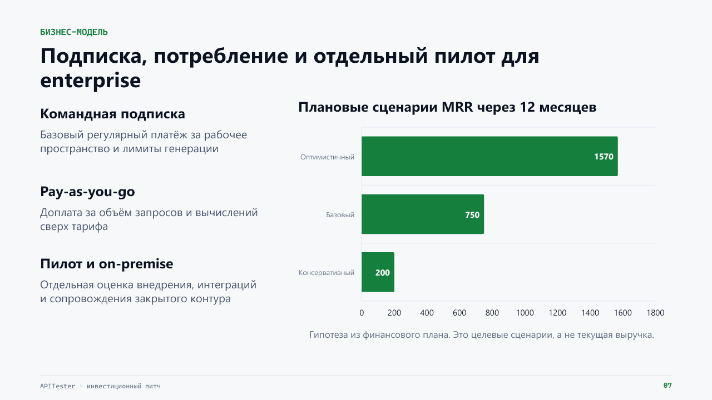
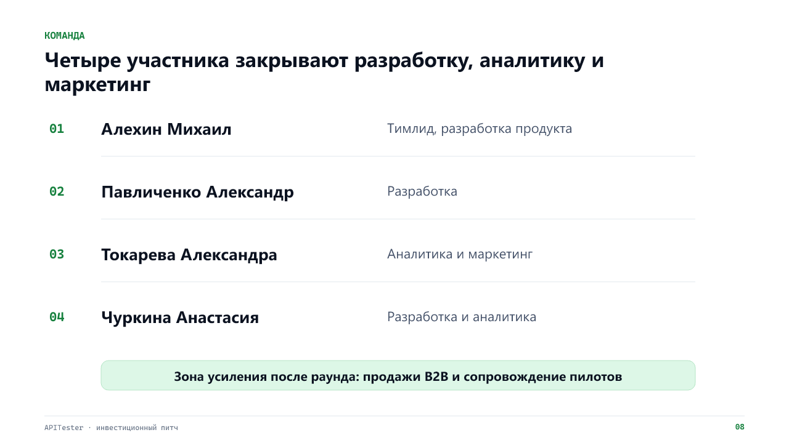
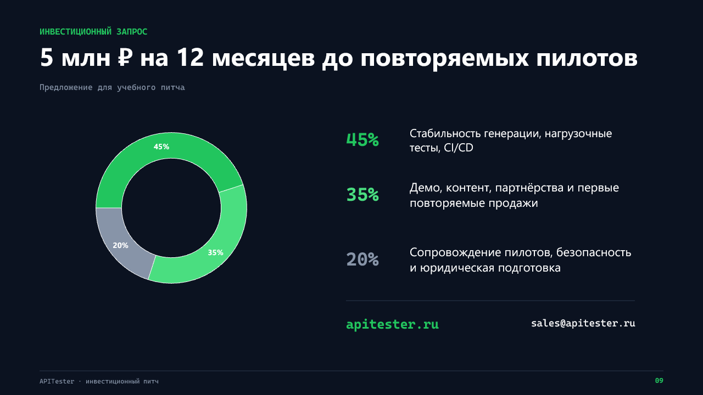

# Стартап в информационных технологиях
## Практические занятия 7-8
## Тема практических занятий: Поиск инвесторов и привлечение инвестиций

### Команда №7
|Участник|Роль|
|---|---|
|Алехин Михаил Алексеевич|Тимлид/Разработчик|
|Павличенко Александр Иванович|Разработчик|
|Токарева Александра Евгеньевна|Аналитик/Маркетолог|
|Чуркина Анастасия Дмитриевна|Разработчик/Аналитик|

---

## 1. Цель работы

Подготовить краткий инвестиционный питч APITester на 1,5-2 минуты. Презентация должна объяснить проблему, решение, целевого клиента, текущее состояние продукта, бизнес-модель, команду и запрос на финансирование.

## 2. Профиль инвестора

Для учебного питча выбран **бизнес-ангел или pre-seed фонд с опытом B2B SaaS и инструментов для разработчиков**. Такой инвестор может дать не только деньги, но и доступ к продуктовым командам, которые подходят для пилотных внедрений.

Проекту важен инвестор, который понимает особенности корпоративных продаж: длинный цикл согласования, требования к безопасности и необходимость показать результат на инфраструктуре заказчика до заключения договора.

## 3. Логика питч-дека

Презентация состоит из девяти слайдов:

1. название и краткое обещание продукта;
2. проблема QA- и backend-команд;
3. сценарий работы APITester;
4. текущее состояние продукта;
5. целевой клиент и контекст покупки;
6. сравнение с альтернативами;
7. бизнес-модель и плановые сценарии;
8. команда;
9. инвестиционный запрос.

Финансовые значения в презентации обозначены как плановые сценарии. Текущая выручка и платящие клиенты не заявляются, потому что проект находится на стадии первых внедрений.

## 4. Elevator pitch

QA-команды тратят много времени на написание и поддержку API-тестов, а крупные компании не всегда могут передавать спецификации во внешние облачные сервисы. Мы создаём APITester: платформа принимает OpenAPI-описание и текстовую постановку задачи, формирует редактируемые сценарии, запускает их и сохраняет историю результатов.

Сейчас в интерфейсе работают модульное, интеграционное и сквозное тестирование, нагрузочное находится в разработке. Платформа доступна на apitester.ru и может работать как командный веб-сервис или разворачиваться в закрытом контуре заказчика.

Основная аудитория проекта: QA-лиды, backend-команды и технические руководители среднего и крупного бизнеса. Бизнес-модель сочетает командную подписку, оплату дополнительного объёма и отдельные пилотные проекты для enterprise.

Команда из четырёх человек уже закрывает разработку, аналитику и маркетинг. Для учебного инвестиционного предложения мы рассматриваем 5 миллионов рублей на 12 месяцев. Средства нужны для повышения стабильности генерации, запуска нагрузочного тестирования и CI/CD-интеграций, а также для системной работы с пилотами и продажами.

## 5. Презентация

Редактируемый файл: [APITester_pitch_deck.pptx](assets/practices_07-08/APITester_pitch_deck.pptx).

### Слайд 1. APITester

### Слайд 2. Проблема

### Слайд 3. Решение

### Слайд 4. Продукт и стадия

### Слайд 5. Целевой клиент

### Слайд 6. Конкуренты

### Слайд 7. Бизнес-модель

### Слайд 8. Команда

### Слайд 9. Инвестиционный запрос

## 6. Подготовка к защите

Для выступления используется короткий текст из раздела 4. Слайды не читаются дословно: каждый из них поддерживает один тезис. Основное время отводится проблеме, текущему состоянию продукта и тому, что даст финансирование.

Контрольные вопросы перед защитой:

- понятно ли, кто принимает решение о покупке;
- не выдаются ли плановые показатели за достигнутые;
- объяснено ли преимущество закрытого контура;
- укладывается ли выступление в две минуты;
- заканчивается ли выступление конкретным запросом.

## 7. Вывод

Питч-дек показывает APITester как работающий технический продукт на ранней стадии, а не как готовый масштабный бизнес. Такая подача соответствует фактическому состоянию проекта: сильная сторона уже видна в продукте и архитектуре, а инвестиции нужны для проверки продаж, повторяемых пилотов и завершения продуктовой линейки.
